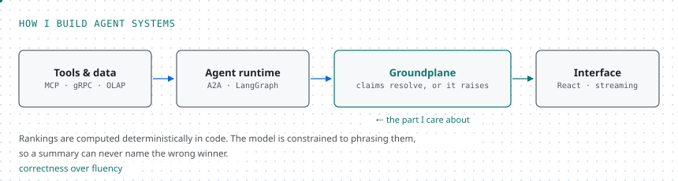

### Hi, I'm Jun Xiong 👋

Software engineer in Singapore. I build AI infrastructure at TikTok by day and small tools by night, mostly to catch machines being confidently wrong.

- 💼 AI Infrastructure Engineer at [TikTok](https://www.tiktok.com), Global E-commerce
- 🛠 Currently building tools that make an agent prove what it says before anyone reads it
- 🏢 Ran a one-person AI company on the side until a client bought it
- 🎾 Away from the keyboard: tennis, a trading journal I actually keep, and a home server that always needs something
- 💬 Ask me about agent runtimes, MCP, A2A, Go services, or why the ranking should never come from the model
- 📫 [junxiong.dev](https://junxiong.dev) · [LinkedIn](https://www.linkedin.com/in/junx6/) · [notes](https://notes.junxiong.dev) · [email](mailto:junxiongong2@gmail.com)

<code></code>
<code></code>
<code></code>
<code></code>
<code></code>
<code></code>

How I build agent systems

 
<picture>
  <source media="(prefers-color-scheme: dark)" srcset="assets/stack-dark.svg">
  <source media="(prefers-color-scheme: light)" srcset="assets/stack-light.svg">
  
</picture>

